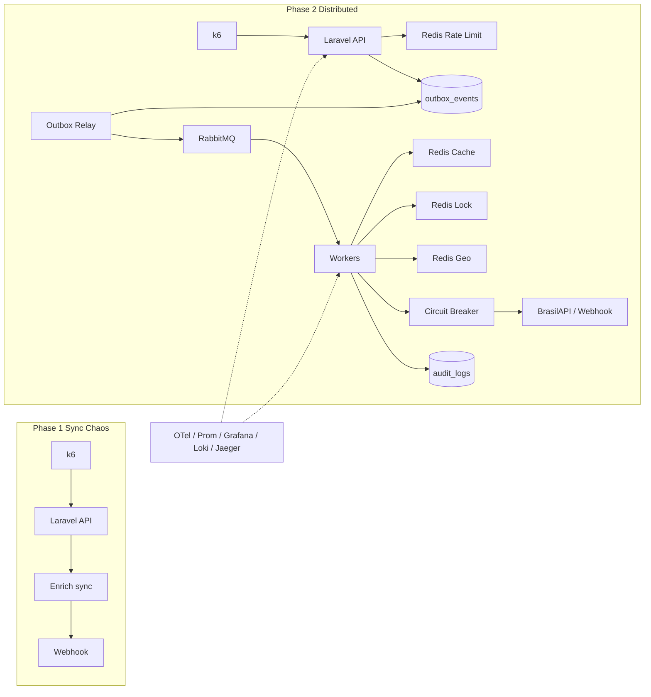
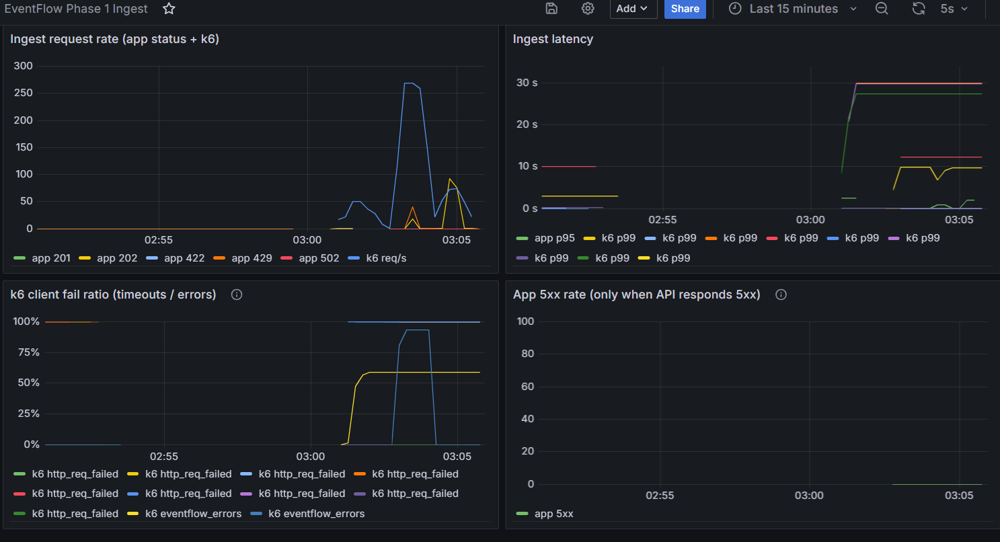
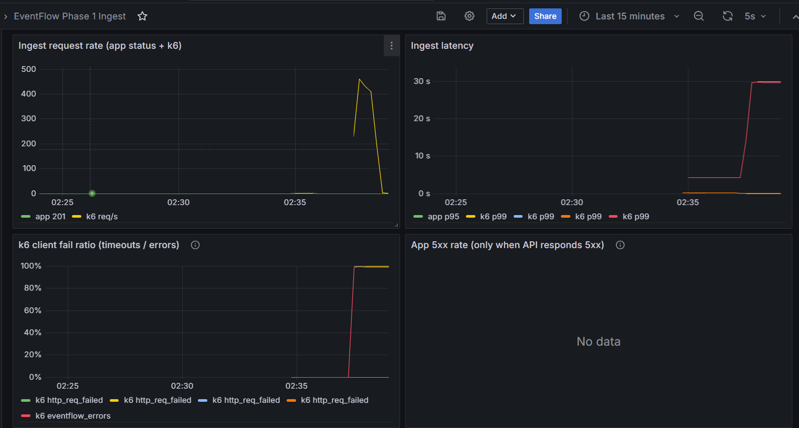
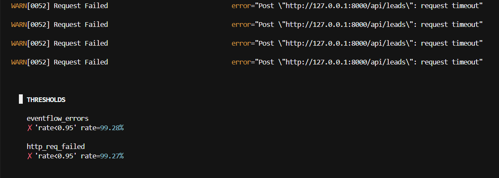
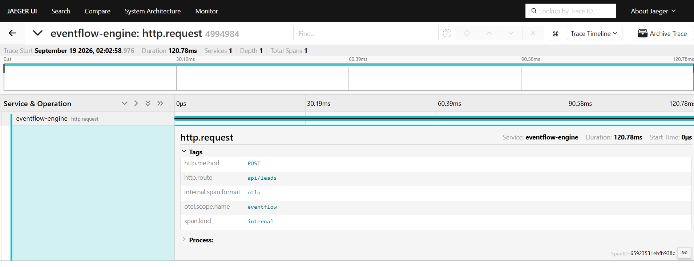
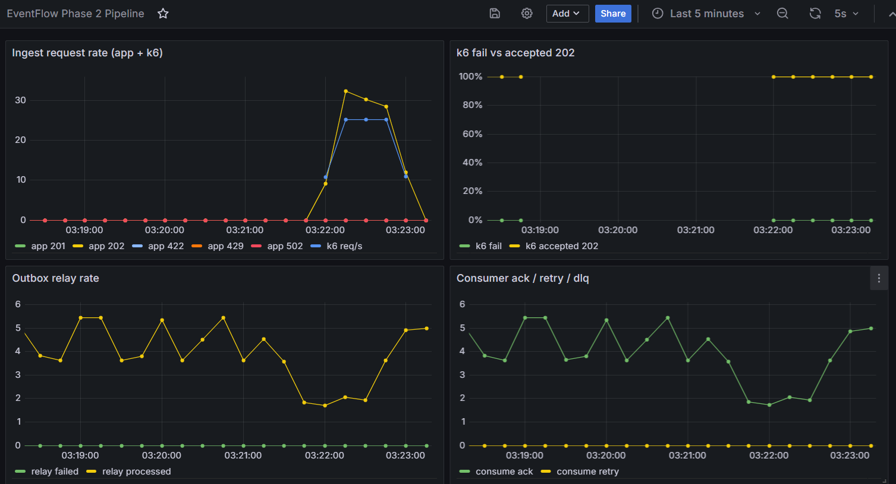
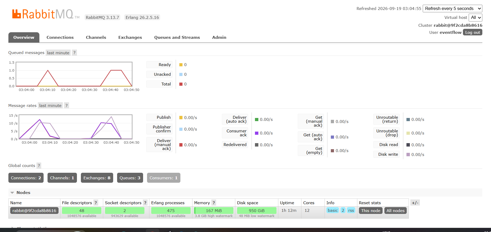

# EventFlow Engine

[](https://www.php.net/)
[](https://laravel.com/)
[](https://www.postgresql.org/)
[](https://redis.io/)
[](https://www.rabbitmq.com/)
[](https://k6.io/)

Multi-tenant **ingest → enrich → dispatch** platform for mass leads/events.

This repository tells a deliberate **Before vs After** story: the same Laravel app, switched by `EVENTFLOW_MODE`, shows why a synchronous path collapses under load — and how a transactional outbox + RabbitMQ + Redis architecture keeps the API edge healthy while workers drain work asynchronously.

Local evidence (Octane/FrankenPHP in Docker): **Phase 1** @ ~1000 RPS target → ~**59%** client fail, p95 ~**30s** timeouts. **Phase 2** ingest → **100%** HTTP `202`, **0%** fail; relay/consume drain without DLQ.

| Mode | Env | HTTP behavior |
|------|-----|----------------|
| **Phase 1 — Before** | `EVENTFLOW_MODE=phase1` | Validate → enrich → webhook → audit **in one request** |
| **Phase 2 — After** | `EVENTFLOW_MODE=phase2` | Validate → rate limit → **outbox** → **202**; workers do the heavy work |

---

## Architecture



### Layering (CSR)

`Controller → Service → Repository → Model` — queries never live in controllers, jobs, or HTTP handlers.

### Stack

| Concern | Choice |
|---------|--------|
| API | Laravel 13 (PHP 8.5) |
| DB | PostgreSQL (UUID + JSONB) |
| Broker | RabbitMQ (main + retry TTL + DLQ) |
| Redis ×4 | Cache Aside · Distributed Lock · Rate Limiter · Geo |
| Enrichment | BrasilAPI CNPJ (config-driven) |
| Resilience | Circuit breaker around outbound HTTP |
| Observability | Prometheus · Grafana · Loki · Jaeger (OTLP) |
| Load | k6 (`k6/phase1-ingest.js`, `k6/phase2-ingest.js`) |

---

## Before — Phase 1 (sync chaos)

**Idea:** One HTTP request does everything. Great for a demo until traffic arrives.

```
POST /api/leads → auth → enrich (BrasilAPI) → webhook → audit_logs → 201
```

Under aggressive k6 (target **1000 RPS**, Octane 8 workers):

- Latency p95 hits the **~30s** client timeout ceiling
- Client fail ratio climbs (**~60–99%** timeouts / errors) — often with almost **no app 5xx** (the API simply stops answering in time)
- PHP workers + DB connections saturate; enrichment/webhook on the request path cascade

### Evidence (Phase 1)

| Artifact | Location |
|----------|----------|
| Screenshots | [`phase1/`](phase1/) |
| k6 script | [`k6/phase1-ingest.js`](k6/phase1-ingest.js) |
| Runbook | [`k6/README.md`](k6/README.md) |
| Grafana dashboard | **EventFlow Phase 1 Ingest** (provisioned) |

**Grafana — ingest chaos** (rate spike, latency pegged, high client fail, little/no 5xx):



**Grafana — fail ratio** (client errors → 100% under burst):



**k6 terminal** (request timeouts / failed thresholds):



**Jaeger** — single `http.request` span on `POST /api/leads`:



---

## After — Phase 2 (distributed)

**Idea:** The API only accepts work safely. Workers own enrichment and dispatch.

```
POST /api/leads → auth → Redis rate limit → outbox_events (same DB txn) → 202
                      ↓
            eventflow:relay-outbox → RabbitMQ
                      ↓
            eventflow:consume-leads
                 lock → cache/geo → CB → webhook → audit
```

### Why Outbox (dual-write)

Publishing to RabbitMQ *inside* the HTTP request alone can lose messages if the broker ack succeeds and the DB fails (or the reverse). Phase 2 writes the raw payload to `outbox_events` in the **same SQL transaction** as the accept path; a relay worker publishes asynchronously and marks rows processed/failed with `attempts`.

### Redis — four separate roles

| Role | Class / prefix | Purpose |
|------|----------------|---------|
| Cache Aside | `CacheAsideEnrichmentStore` | CNPJ enrichment TTL |
| Lock | `LeadProcessingLock` | No duplicate concurrent processing |
| Rate limit | `CacheTenantRateLimiter` | Per-tenant plan ceilings |
| Geo | `LeadGeoIndex` | `GEOADD` / radius when `lat`/`lng` present |

### Resilience

- RabbitMQ **retry** queue (TTL → main) and **DLQ** for poison messages  
- **Circuit breaker** (closed / open / half-open) on webhook + enrichment HTTP  
- W3C **traceparent** propagated HTTP → outbox → AMQP → consumer → Jaeger (OTLP)

### Evidence (Phase 2)

| Artifact | Location |
|----------|----------|
| Screenshots | [`phase2/`](phase2/) |
| k6 script | [`k6/phase2-ingest.js`](k6/phase2-ingest.js) |
| Grafana dashboard | **EventFlow Phase 2 Pipeline** |
| Tracing runbook | [`observability/README.md`](observability/README.md) |

The After story is **API stability + async drain**, not “same RPS forever on one box”. Ingest returns `202` fast; relay/consume process at worker pace with **0** relay fail / **0** retry-DLQ in the capture below.

**Grafana — pipeline stable** (`accepted 202` = 100%, fail = 0%, relay + consume healthy):



**RabbitMQ** — queues drained (ready/unacked = 0 after the run):



---

## Quick start

### 1. Infrastructure

```bash
docker compose up -d
cp .env.example .env
composer install
php artisan key:generate
php artisan migrate --seed
```

Demo API keys (after seed) are commented in `.env.example`.

### 2. Observability

| Service | URL |
|---------|-----|
| Grafana | http://localhost:3000 (`admin` / `admin`) |
| Prometheus | http://localhost:9090 |
| Jaeger | http://localhost:16686 |
| RabbitMQ UI | http://localhost:15672 (`eventflow` / `eventflow`) |
| App metrics | http://localhost:8000/api/metrics |

Details: [`observability/README.md`](observability/README.md).

### 3. Phase 1 (Before)

```bash
# .env → EVENTFLOW_MODE=phase1
docker compose up -d api   # Octane/FrankenPHP (8 workers) — prefer this over `artisan serve`
# mocks on :8090 / :8091 if using local enrichment/webhook fallbacks
k6 run -o experimental-prometheus-rw ^
  -e K6_PROMETHEUS_RW_SERVER_URL=http://127.0.0.1:9090/api/v1/write ^
  -e BASE_URL=http://127.0.0.1:8000 -e API_KEY=ef_demo_basic_key_change_me ^
  -e TARGET_RPS=1000 -e DURATION=30s k6/phase1-ingest.js
```

### 4. Phase 2 (After)

```bash
# .env → EVENTFLOW_MODE=phase2  (raise EVENTFLOW_RATE_LIMIT_* for load demos)
docker compose up -d api relay-outbox consume-leads

k6 run -o experimental-prometheus-rw ^
  -e K6_PROMETHEUS_RW_SERVER_URL=http://127.0.0.1:9090/api/v1/write ^
  -e BASE_URL=http://127.0.0.1:8000 -e API_KEY=ef_demo_enterprise_key_change_me ^
  -e TARGET_RPS=80 -e DURATION=20s -e PRE_VUS=40 -e MAX_VUS=200 k6/phase2-ingest.js
```

Evidence screenshots used `TARGET_RPS=80` on a clean outbox (no multi-run backlog). Higher targets work until Postgres/outbox backlog saturates latency — clear `PENDING` rows or wait for relay drain between demos.

Workers + API run in Docker (PHP 64-bit). Host `php artisan serve` is fine for smoke tests only — not for k6 ≥ hundreds RPS.

### 5. Tests

```bash
php artisan test
```

---

## API sketch

```http
POST /api/leads
X-Api-Key: <tenant api_key>
Content-Type: application/json

{ "cnpj": "00000000000191", "name": "Acme", "lat": -23.55, "lng": -46.63 }
```

- Phase 1 → `201` + `audit_id`  
- Phase 2 → `202` + `outbox_id`  
- Invalid key → `401` · validation → `422` · rate limit (phase2) → `429`

---

## Domain tables

- `tenants` — UUID, `api_key` (indexed), plan `basic` \| `pro` \| `enterprise`  
- `outbox_events` — JSONB payload, status `PENDING` \| `PROCESSING` \| `PROCESSED` \| `FAILED`, `attempts`  
- `audit_logs` — enriched JSONB, status `SUCCESS` \| `DISPATCHED` \| `ERROR`

---

## Branching

Work on feature branches. Local git hooks (`.githooks/`) block direct commits/pushes to `main`.

---

## Specs (local only)

Implementation was driven by Kiro-style specs under `.cursor/specs/eventflow-engine/` (requirements, design, tasks). That folder is **gitignored** — clone the repo for the running system; use local Cursor rules/specs if you extend the product.

---

## License

MIT (or project default). Portfolio / learning project — not a production SaaS.
