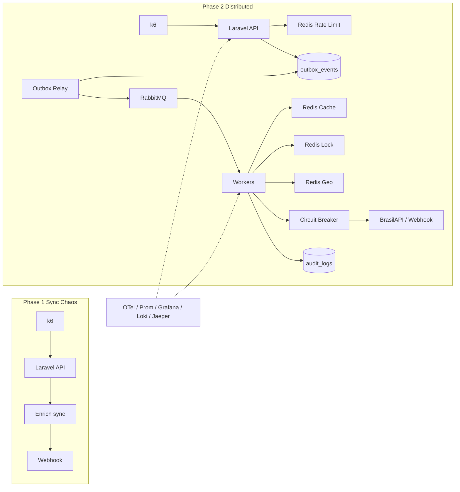

# EventFlow Engine

**Idioma:** [English](README.md) · Português

[](https://www.php.net/)
[](https://laravel.com/)
[](https://www.postgresql.org/)
[](https://redis.io/)
[](https://www.rabbitmq.com/)
[](https://k6.io/)

Plataforma multi-tenant de **ingest → enrich → dispatch** para leads/eventos em massa.

**O que é isto:** lab de portfólio / aprendizado feito para **demonstrar e medir carga** (k6 + Grafana), **não** um SaaS de produção. Serve para reproduzir colapso Antes/Depois sob RPS e fairness de exports multi-tenant com JOINs pesados de CRM.

Este repositório conta uma história deliberada de **Antes vs Depois**: o mesmo app Laravel, alternado por `EVENTFLOW_MODE`, mostra por que o caminho síncrono colapsa sob carga — e como outbox transacional + RabbitMQ + Redis mantém a borda da API saudável enquanto workers drenam o trabalho de forma assíncrona.

Evidência local (Octane/FrankenPHP no Docker): **Phase 1** @ ~1000 RPS alvo → ~**59%** falha no cliente, p95 ~**30s** timeouts. **Phase 2** ingest → **100%** HTTP `202`, **0%** falha; relay/consume drenam sem DLQ.

| Modo | Env | Comportamento HTTP |
|------|-----|---------------------|
| **Phase 1 — Antes** | `EVENTFLOW_MODE=phase1` | Validar → enriquecer → webhook → audit **no mesmo request** |
| **Phase 2 — Depois** | `EVENTFLOW_MODE=phase2` | Validar → rate limit → **outbox** → **202**; workers fazem o trabalho pesado |

---

## Arquitetura



### Camadas (CSR)

`Controller → Service → Repository → Model` — queries nunca ficam em controllers, jobs ou handlers HTTP.

### Stack

| Concern | Escolha |
|---------|---------|
| API | Laravel 13 (PHP 8.5) |
| DB | PostgreSQL (UUID + JSONB) |
| Broker | RabbitMQ (main + retry TTL + DLQ) |
| Redis ×4 | Cache Aside · Distributed Lock · Rate Limiter · Geo |
| Enrichment | BrasilAPI CNPJ (via config) |
| Resilience | Circuit breaker em HTTP de saída |
| Observability | Prometheus · Grafana · Loki · Jaeger (OTLP) |
| Load | k6 (`k6/phase1-ingest.js`, `k6/phase2-ingest.js`, `k6/exports-multi-tenant.js`) |

---

## Antes — Phase 1 (caos síncrono)

**Ideia:** Um request HTTP faz tudo. Ótimo pra demo — até chegar tráfego.

```
POST /api/leads → auth → enrich (BrasilAPI) → webhook → audit_logs → 201
```

Sob k6 agressivo (alvo **1000 RPS**, Octane 8 workers):

- Latência p95 bate no teto de timeout do cliente (~**30s**)
- Taxa de falha no cliente sobe (**~60–99%** timeouts / erros) — muitas vezes **quase sem 5xx** da app (a API simplesmente deixa de responder a tempo)
- Workers PHP + conexões de DB saturam; enrich/webhook no caminho do request cascateiam

### Evidência (Phase 1)

| Artefato | Local |
|----------|-------|
| Screenshots | [`phase1/`](phase1/) |
| Script k6 | [`k6/phase1-ingest.js`](k6/phase1-ingest.js) |
| Runbook | [`k6/README.md`](k6/README.md) |
| Dashboard Grafana | **EventFlow Phase 1 Ingest** (provisionado) |

**Grafana — caos no ingest** (pico de rate, latência no teto, alta falha no cliente, pouco/nenhum 5xx):


**Grafana — fail ratio** (erros do cliente → 100% no burst):


**Terminal k6** (timeouts / thresholds falhando):


**Jaeger** — span único `http.request` em `POST /api/leads`:


---

## Depois — Phase 2 (distribuído)

**Ideia:** A API só aceita trabalho com segurança. Workers cuidam de enrich e dispatch.

```
POST /api/leads → auth → Redis rate limit → outbox_events (mesma txn DB) → 202
                      ↓
            eventflow:relay-outbox → RabbitMQ
                      ↓
            eventflow:consume-leads
                 lock → cache/geo → CB → webhook → audit
```

### Por que Outbox (dual-write)

Publicar no RabbitMQ *dentro* do request HTTP sozinho pode perder mensagem se o ack do broker ok e o DB falhar (ou o inverso). A Phase 2 grava o payload em `outbox_events` na **mesma transação SQL** do accept; um relay publica de forma assíncrona e marca `processed`/`failed` com `attempts`.

### Redis — quatro papéis separados

| Papel | Classe / prefix | Propósito |
|------|-----------------|-----------|
| Cache Aside | `CacheAsideEnrichmentStore` | TTL do enrich de CNPJ |
| Lock | `LeadProcessingLock` | Sem processamento duplicado concorrente |
| Rate limit | `CacheTenantRateLimiter` | Tetos por plano do tenant |
| Geo | `LeadGeoIndex` | `GEOADD` / raio quando há `lat`/`lng` |

### Resiliência

- Fila RabbitMQ de **retry** (TTL → main) e **DLQ** para mensagens venenosas  
- **Circuit breaker** (closed / open / half-open) em webhook + enrichment HTTP  
- **traceparent** W3C propagado HTTP → outbox → AMQP → consumer → Jaeger (OTLP)  
- **Idempotency-Key** no ingest (phase2) — a mesma key devolve o mesmo `outbox_id`  
- **Backpressure do outbox** — `EVENTFLOW_OUTBOX_MAX_PENDING*` opcional → HTTP `503` se o backlog estourar  
- **Retenção do outbox** — `php artisan eventflow:prune-outbox` (agendado diário) apaga `PROCESSED` antigos  

### API de leitura do pipeline (por tenant)

Ver leads entrando/saindo do pipe (não só agregados no Grafana):

| Método | Path | Notas |
|--------|------|--------|
| `GET` | `/api/outbox` | Paginado; `?status=PENDING` |
| `GET` | `/api/outbox/{id}` | Evento único |
| `GET` | `/api/audit-logs` | Paginado; `?status=DISPATCHED` |
| `GET` | `/api/audit-logs/{id}` | Audit único |
| `GET` | `/api/health` | Readiness DB + Redis + RabbitMQ |
| `GET` | `/api/metrics` | Texto Prometheus — exige `EVENTFLOW_METRICS_TOKEN` (Bearer / `X-Metrics-Token` / `?token=`) |

Rotas de tenant continuam pedindo `X-Api-Key`.

### Evidência (Phase 2)

| Artefato | Local |
|----------|-------|
| Screenshots | [`phase2/`](phase2/) |
| Script k6 | [`k6/phase2-ingest.js`](k6/phase2-ingest.js) |
| Dashboard Grafana | **EventFlow Phase 2 Pipeline** |
| Runbook de tracing | [`observability/README.md`](observability/README.md) |

A história do Depois é **estabilidade da API + drain assíncrono**, não “o mesmo RPS pra sempre numa máquina só”. O ingest devolve `202` rápido; relay/consume processam no ritmo dos workers com **0** relay fail / **0** retry-DLQ no print abaixo.

**Grafana — pipeline estável** (`accepted 202` = 100%, fail = 0%, relay + consume saudáveis):


**RabbitMQ** — filas drenadas (ready/unacked = 0 após o run):


---

## Quick start

### 1. Infraestrutura

```bash
docker compose up -d
cp .env.example .env
composer install
php artisan key:generate
php artisan migrate --seed
```

As API keys de demo (após o seed) estão comentadas no `.env.example`.

### 2. Observabilidade

| Serviço | URL |
|---------|-----|
| Grafana | http://localhost:3000 (`admin` / `admin`) — dashboards Phase 1, Phase 2, **CRM Exports Fairness** |
| Board exports | http://localhost:8000/lab/exports (WebSocket Reverb; fairness ao vivo) |
| Prometheus | http://localhost:9090 |
| Jaeger | http://localhost:16686 |
| RabbitMQ UI | http://localhost:15672 (`eventflow` / `eventflow`) |
| Métricas da app | http://localhost:8000/api/metrics (Bearer `EVENTFLOW_METRICS_TOKEN`) |
| Health da app | http://localhost:8000/api/health |

Detalhes: [`observability/README.md`](observability/README.md).

### 3. Phase 1 (Antes)

```bash
# .env → EVENTFLOW_MODE=phase1
docker compose up -d api   # Octane/FrankenPHP (8 workers) — preferir em vez de `artisan serve`
# mocks em :8090 / :8091 se usar fallbacks locais de enrich/webhook
k6 run -o experimental-prometheus-rw ^
  -e K6_PROMETHEUS_RW_SERVER_URL=http://127.0.0.1:9090/api/v1/write ^
  -e BASE_URL=http://127.0.0.1:8000 -e API_KEY=ef_demo_basic_key_change_me ^
  -e TARGET_RPS=1000 -e DURATION=30s k6/phase1-ingest.js
```

### 4. Phase 2 (Depois)

```bash
# .env → EVENTFLOW_MODE=phase2  (suba EVENTFLOW_RATE_LIMIT_* em demos de carga)
docker compose up -d api relay-outbox consume-leads

k6 run -o experimental-prometheus-rw ^
  -e K6_PROMETHEUS_RW_SERVER_URL=http://127.0.0.1:9090/api/v1/write ^
  -e BASE_URL=http://127.0.0.1:8000 -e API_KEY=ef_demo_enterprise_key_change_me ^
  -e TARGET_RPS=80 -e DURATION=20s -e PRE_VUS=40 -e MAX_VUS=200 k6/phase2-ingest.js
```

Os screenshots de evidência usaram `TARGET_RPS=80` com outbox limpo (sem backlog de vários runs). Alvos maiores funcionam até o backlog Postgres/outbox saturar a latência — espere o relay drenar, ative caps de backpressure, ou rode `php artisan eventflow:prune-outbox` para `PROCESSED` antigos (**não** apague `PENDING` em produção).

Workers + API rodam no Docker (PHP 64-bit). `php artisan serve` no host serve só pra smoke — não pra k6 com centenas de RPS.

### 4b. Exports CRM multi-tenant (demo de fairness)

JOINs pesados de `commercial_dossier` com um tenant **whale** (enterprise, ~2000 deals) e tenants **light** (basic/pro, ~100 deals).

#### Por que basic/pro não são engolidos pelo enterprise

RabbitMQ **não** escolhe quem roda. Só manda um **wake** (“tem trabalho”) na fila `exports.requested`. Quem processa é o **claim no Postgres** (`claimNextFair`):

1. **Só pode tantos por plano** — limite de exports em `PROCESSING` ao mesmo tempo (defaults do lab):
   - `basic` → 3  
   - `pro` → 5  
   - `enterprise` → 4  
   - **global** → 16 (todos juntos)  
   Whale no teto (ex.: já 4 processing) → **nenhum worker pega outro whale** até algum terminar; sobra slot para light.
2. **Preferência light** — entre os `PENDING` que ainda cabem no cap: ordem **basic → pro → enterprise**, depois o mais antigo. Enterprise não “fura” só por ser whale.
3. **Vários workers em paralelo** — `FOR UPDATE SKIP LOCKED` para não serializar no mesmo conjunto de rows.

O JOIN do enterprise ainda pode levar ~segundos; o ponto é que ele **não monopoliza todos os workers**. Light continua completando sob contenção.

Caps ajustáveis: `EVENTFLOW_EXPORT_MAX_PROCESSING_BASIC|PRO|ENTERPRISE|GLOBAL` no `.env`.


#### Para que serve essa arquitetura (e para que não)

| Resolve | Não resolve sozinha |
|---|---|
| API barata (`202` em dezenas–centenas de ms) sob carga de export | O JOIN/CSV em si (whale ainda custa segundos) |
| Sistema não cai quando RPS ≫ capacidade de processar | Wait de fila se você sobrecarrega de propósito (demo do lab) |
| Fairness multi-tenant com um tenant pesado | Entrega instantânea sem mais workers / relatório menor |

Accept async ≠ download na hora. O cliente ainda espera o processamento; a plataforma continua de pé e justa enquanto isso acontece.

#### Board ao vivo

http://localhost:8000/lab/exports — um snapshot no load, depois **Laravel Reverb** WebSocket (`exports.lab` / `export.updated`). Sem poll Alpine. Precisa de `reverb` + `queue-exports-broadcast` (broadcast em fila para o POST não esperar o WebSocket).

#### Rodar

```bash
php artisan migrate
php artisan eventflow:seed-crm-load --whale=2000 --light=100
docker compose up -d api process-exports process-exports-b process-exports-c process-exports-d process-exports-e process-exports-f queue-exports-broadcast reverb
npm.cmd run build

k6 run -o experimental-prometheus-rw ^
  -e K6_PROMETHEUS_RW_SERVER_URL=http://127.0.0.1:9090/api/v1/write ^
  -e BASE_URL=http://127.0.0.1:8000 -e WHALE_RPS=1 -e LIGHT_RPS=5 -e DURATION=30s ^
  k6/exports-multi-tenant.js
```

Keys de demo (seed): `ef_export_whale_key`, `ef_export_light_a_key`, `ef_export_light_b_key`.

Grafana: **EventFlow CRM Exports Fairness** (accept vs completed, wait por plano, duração do process, latência do accept). RabbitMQ UI: `exports.requested` deve ser fila de wake fina — não fila de trabalho por export.

Caps / coalesce (além dos números acima): `EVENTFLOW_EXPORT_WAKE_COALESCE_MS` (ver `.env.example`).

Runbook: [`k6/README.md`](k6/README.md) → **Multi-tenant CRM exports**.

### 5. Testes

```bash
php artisan test
```

---

## Esboço da API

```http
POST /api/leads
X-Api-Key: <tenant api_key>
Idempotency-Key: <chave-opcional-estavel>
Content-Type: application/json

{ "cnpj": "00000000000191", "name": "Acme", "lat": -23.55, "lng": -46.63 }
```

- Phase 1 → `201` + `audit_id`  
- Phase 2 → `202` + `outbox_id` (`idempotent_replay: true` se a key já existia)  
- Key inválida → `401` · validação → `422` · rate limit (phase2) → `429` · backpressure do outbox → `503`

```http
GET /api/outbox?status=PENDING
X-Api-Key: <tenant api_key>
```

```http
POST /api/exports
X-Api-Key: <tenant api_key>
Idempotency-Key: <opcional>
Content-Type: application/json

{ "report": "commercial_dossier", "format": "csv", "filters": {} }
```

- Async → `202` + `export_id` · sync (`"sync": true`) → `200` quando completo  
- `GET /api/exports/{id}` → status + `wait_ms` · `GET .../download` → CSV

---

## Tabelas de domínio

- `tenants` — UUID, `api_key` (indexado), plan `basic` \| `pro` \| `enterprise`  
- `outbox_events` — `tenant_id`, payload JSONB, `idempotency_key` opcional, status `PENDING` \| `PROCESSING` \| `PROCESSED` \| `FAILED`, `attempts`  
- `audit_logs` — `tenant_id`, JSONB enriquecido, status `SUCCESS` \| `DISPATCHED` \| `ERROR`
- `crm_*` + `exports` — dossiê comercial multi-tabela e fila justa de export

---

## Branching

Trabalho em feature branches. Hooks locais (`.githooks/`) bloqueiam commit/push direto em `main`.

---

## Specs (só local)

A implementação foi guiada por specs estilo Kiro em `.cursor/specs/eventflow-engine/` (requirements, design, tasks). Essa pasta é **gitignored** — clone o repo pro sistema rodando; use rules/specs locais do Cursor se for estender o produto.

---

## License

MIT (ou default do projeto). **Lab de testes de carga / portfólio** — não é SaaS de produção.
